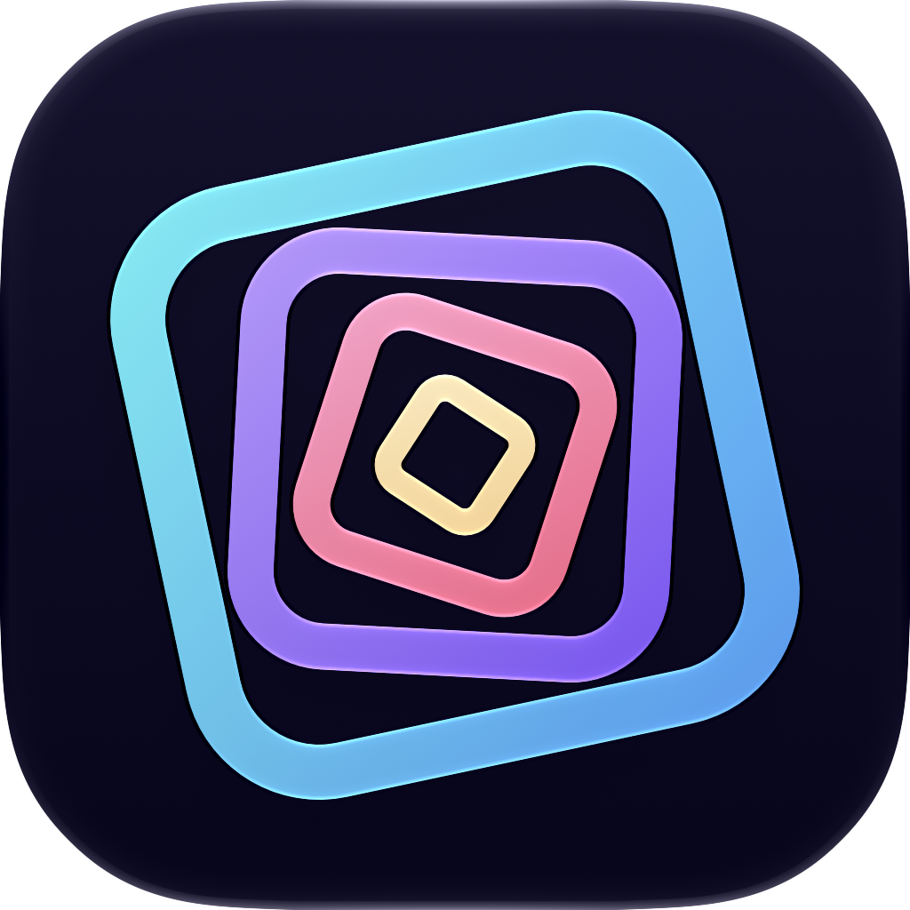

# Recursive Art

An experimental iPhone and iPad app that combines the live camera view with animated shapes, colours, and visual effects.

Mirror the app to a screen or projector, then point the camera at it. The image repeats within itself, creating evolving patterns and light trails that can be captured as photos or videos.
